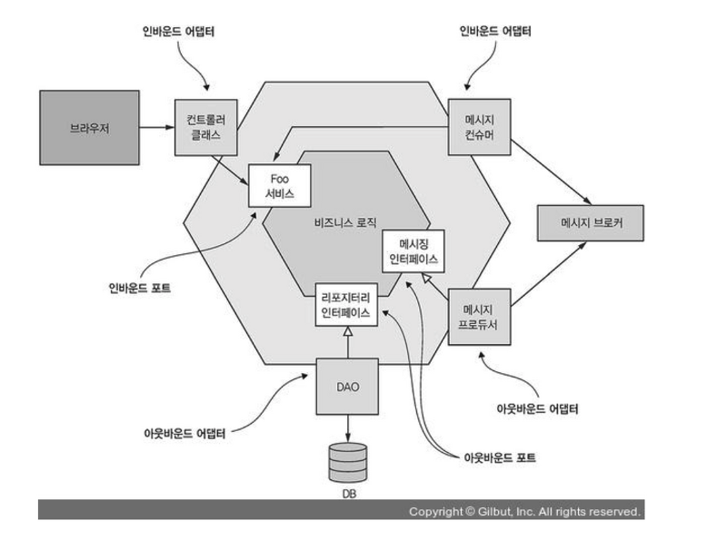

# 개발 가이드 - V1.0 (작성중)

## 개발 환경

* [Docker Client](https://www.docker.com/)
* [JAVA17](https://docs.aws.amazon.com/corretto/latest/corretto-17-ug/downloads-list.html)
* [Spring boot 3.1](https://docs.spring.io/spring-boot/docs/3.1.6/gradle-plugin/reference/html/)
* [MySQL 8](https://docs.aws.amazon.com/ko_kr/AmazonRDS/latest/AuroraUserGuide/Aurora.AuroraMySQL.Overview.html)
* [DynamoDB](https://aws.amazon.com/ko/dynamodb/)
* [FaKer](https://github.com/DiUS/java-faker)
* [Formatter](https://github.com/google/styleguide)
* [QueryDSL](http://querydsl.com/)
* [TestContainers](https://testcontainers.com/)

---

## 실행 방법

* [torder-infra-docker-compose.yml](dockers%2Ftorder-infra-docker-compose.yml) 실행
* [TorderRestApplication.java](service-base%2Fservice-combine%2Fsrc%2Fmain%2Fjava%2Fcom%2Ftorder%2Fapp%2Frest%2FTorderRestApplication.java)
  실행

---

## 헥사고날 아키텍처

<P>
   
</P>

### 장점

* 모듈성과 유연성: 각 층이 분리되어 있고, 외부와 내부를 중립적인 인터페이스로 분리함으로써 모듈성과 유연성을 높일 수 있습니다. 이는 새로운 요구 사항에 대응하거나 기존 구성 요소를 교체할 때 유리합니다.
* 테스트 용이성: 내부 도메인 로직을 중심으로 한 인터페이스를 통해 테스트하기 쉽습니다. 외부 환경을 시뮬레이션하여 단위 테스트와 통합 테스트를 쉽게 수행할 수 있습니다.
* 의존성 관리: 외부 요소에 대한 의존성이 내부에서 분리되어 있어 변경 사항이 해당 영역에만 영향을 미치므로 전체 시스템에 미치는 영향이 줄어듭니다.
* 확장성: 새로운 기능을 추가하거나 기존 기능을 확장하기 쉽습니다. 새로운 기능을 구현할 때 내부 로직에 집중할 수 있으며, 기존 구성 요소를 변경하지 않고도 새로운 동작을 추가할 수 있습니다.

### 단점

* 복잡성: 여러 층 간의 상호 작용을 관리해야 하므로 초기 설계와 구현이 복잡할 수 있습니다.
* 오버헤드: 층 간의 통신 및 중개 과정으로 인해 약간의 오버헤드가 발생할 수 있습니다.
* 학습 곡선: 개발자들이 이 아키텍처를 이해하고 구현하는 데 시간이 걸릴 수 있습니다.

## 패키지 구조

```
.
├── gradle
│   └── wrapper
├── service-base ----------------------------------------------------------- 베이스 프로젝트
│   ├── service-combine ---------------------------------------------------- 서비스 노출 계층
│   │   └── src
│   │       └── main
│   │           ├── java
│   │           │   └── com
│   │           │       └── torder
│   │           │           └── app
│   │           │               └── rest ----------------------------------- Rest 어플리케이션
│   │           └── resources
│   ├── service-common-application  ---------------------------------------- 공통 어플리케이션 계층
│   │   └── src
│   │       └── main
│   │           ├── java
│   │           │   └── com
│   │           │       └── torder
│   │           │           └── service
│   │           │               └── common
│   │           │                   ├── application 
│   │           │                   │   ├── mappper ------------------------ 공통 어플리케이션 mapper
│   │           │                   │   ├── port
│   │           │                   │   │   ├── in ------------------------- 공통 어플리케이션 UseCase
│   │           │                   │   │   └── out ------------------------ 공통 어플리케이션 Port
│   │           │                   │   └── service ------------------------ 공통 어플리케이션 Servicce
│   │           │                   └── domain ----------------------------- 공통 어플리케이션 Domain
│   │           └── resources
│   │               └── massages
│   ├── service-common-repository  ----------------------------------------- 공통 레포지토리 계층
│   │   └── src
│   │       └── main
│   │           ├── java
│   │           │   └── com
│   │           │       └── torder
│   │           │           └── service
│   │           │               └── common
│   │           │                   ├── jpa
│   │           │                   │   └── config ------------------------ 공통 레포지토리 Config
│   │           │                   └── repository
│   │           │                       └── out --------------------------- 공통 레포지토리 outPort
│   │           └── resources
│   ├── service-common-web  ----------------------------------------------- 공통 웹
│   │   └── src
│   │       └── main
│   │           ├── java
│   │           │   └── com
│   │           │       └── torder
│   │           │           └── service
│   │           │               └── common
│   │           │                   ├── config ---------------------------- 공통 웹 Config
│   │           │                   └── in -------------------------------- 공통 UseCase
│   │           │                       └── web --------------------------- 공동 Controller
│   │           └── resources
│   │               └── massages
│   ├── service-goods-base ------------------------------------------------ 상품 도메인 루트 프로젝트
│   │   ├── service-goods-application ------------------------------------- 상품 도메인 어플리케이션 계층
│   │   │   └── src
│   │   │       └── main
│   │   │           ├── java
│   │   │           │   └── com
│   │   │           │       └── torder
│   │   │           │           └── service
│   │   │           │               └── goods
│   │   │           │                   └── pos
│   │   │           │                       ├── application
│   │   │           │                       │   ├── port 
│   │   │           │                       │   │   ├── in ---------------- 상품 도메인 UseCase
│   │   │           │                       │   │   └── out --------------- 상품 도메인 outPort
│   │   │           │                       │   └── service --------------- 상품 도메인 service
│   │   │           │                       └── domain -------------------- 상품 도메인
│   │   │           └── resources
│   │   ├── service-goods-repository
│   │   │   └── src
│   │   │       └── main
│   │   │           ├── java
│   │   │           │   └── com
│   │   │           │       └── torder
│   │   │           │           └── service
│   │   │           │               └── goods
│   │   │           │                   └── pos
│   │   │           │                       ├── log
│   │   │           │                       │   └── out
│   │   │           │                       │       └── persistence ------- 포스 상품 로그 영속성
│   │   │           │                       ├── out
│   │   │           │                       │   └── persitence ------------ 포스 상품 영속성  
│   │   │           │                       └── raw
│   │   │           │                           └── out
│   │   │           │                               └── persistence ------- 포스 인터페이스 로그 영속성
│   │   │           └── resources
│   │   ├── service-goods-web
│   │   │   └── src
│   │   │       └── main
│   │   │           ├── java
│   │   │           │   └── com
│   │   │           │       └── torder
│   │   │           │           └── service
│   │   │           │               └── goods
│   │   │           │                   └── pos
│   │   │           │                       └── in
│   │   │           │                           └── web ------------------- 포스 인터페이스 웹 계층
│   │   │           └── resources
│   │   └── src
│   │       └── main
│   │           ├── java
│   │           └── resources
│   └── src
│       └── main
│           ├── java
│           └── resources
└── src
    └── main
        ├── java
        └── resources

```

## Web Layer (작성중)

### ~ Controller

1. Controller 인터페이스 정의한다.
2. Controller 인터페이스 해당하는 inPort 인터페이스 정의하고 호출한다.
3. ~Param 오브젝트를 inPort 인터페이스에 맞는 스펙으로 변환한다.
    1. Primitive Type 호출 가능한 형태인 경우 Primitive Type 유지한다.
4. ~Domain 오브젝트를 Controller 인터페이스 리턴타입 ResponseModel 오브젝트로 변환한다.
    1. Primitive Type 리턴 가능한 형태인 경우 Primitive Type 유지한다.

### ~ ParamModel(PM 이름으로 변경)

1. Controller 인터페이스로 전송 되는 파라마터를 저장하는 오브젝트.
2. Swagger-UI를 통해 노출될 인터페이스 스펙을 정의한다.
3. Controller 인터페이스로 전송 되는 파라마터의 Validation 정의한다.

### ~ DtoMapper

1. ~Param 오브젝트를 inPort 인터페이스에 맞는 ~Dto 오브젝트로 변환한다. (Optional)
    1. Primitive Type 호출 가능한 형태인 경우 Primitive Type 유지한다.

### ~ ResponseModel(RM 이름으로 변경)

1. ~Controller 인터페이스 리턴 오브젝트. (Optional)

### ~ ResponseModelMapper

1. ~Domain 오브젝트를 Controller 인터페이스 리턴타입 ResponseModel 오브젝트로 변환한다. (Optional)
    1. Primitive Type 리턴 가능한 형태인 경우 Primitive Type 유지한다.

---

## Application Layer

* 도메인 UseCase, OutPort 인터페이스를 정의하고 실행 흐름을 제어한다.

### ~ Service

* useCase 인터페이스를 구현한다.
* 비지니스 로직을 작성하고 Port 인터페이스 실행 흐름을 제어한다.
* 반드시 비지니스 로직 관련 행위 테스트를 작성한다.
* 테스트 시나리오는 반드시 @Display(테스트 시나리오) 명시한다.

### ~ UseCase

* useCase 인터페이스 필요한 in,out 인터페이스를 정의한다.
* primitive type 호출 가능한 형태인 경우 primitive type 유지한다.
* primitive type 리턴 가능한 형태인 경우 primitive type 유지한다.
* 인터페이스 객체 정의시 불변 객체로 지정한다. (Recode 추천)

### ~ UseCaseInDTO (Optional)

* useCase 인터페이스로 파라미터 오브젝트. 
* Validation 정의 한다. (Optional)
* 인터페이스 정의시 불변 객체로 지정한다. (Recode 추천)
* useCaseInDTO 관련 로직을 캡슐화 한다. 
* 캡슐화 로직이 있는 경우 반드시 테스트 케이스를 작성한다.

### ~ UseCaseOutDTO (Optional)

* useCase 인터페이스 리턴 오브젝트. 
* port 구현체를 통해 전달 리턴 되는 오브젝트 조합 후 리턴 한다. 
* UseCaseOutDTO 리턴 관련 로직을 캡슐화 한다. 
* 캡슐화 로직이 있는 경우 반드시 테스트 케이스를 작성한다.

### ~ Port

* port 인터페이스 필요한 in,out 인터페이스를 정의한다. 
* primitive type 호출 가능한 형태인 경우 primitive type 유지한다. 
* primitive type 리턴 가능한 형태인 경우 primitive type 유지한다. 
* 인터페이스 객체 정의시 불변 객체로 지정한다. (Recode 추천)

### ~ InPortDTO (Optional)

* port 인터페이스 파라미터 오브젝트. 
* Validation 정의 한다. (Optional)
* 인터페이스 정의시 불변 객체로 지정한다. (Recode 추천)
* InPortDTO 관련 로직을 캡슐화 한다. 
* 캡슐화 로직이 있는 경우 반드시 테스트 케이스를 작성한다.

### ~ OutPortDTO (Optional)

* port 인터페이스 리턴 오브젝트.
* 인터페이스 정의시 불변 객체로 지정한다. (Recode 추천)
* OutPortDTO 관련 로직을 캡슐화 한다.
* 캡슐화 로직이 있는 경우 반드시 테스트 케이스를 작성한다.

### ~ DomainMapper

* ~ Dto 오브젝트를 Domain 오브젝트로 변환한다.

---

## Repository Layer

* 영속성 모듈을 정의한다.

### ~ Adapter

* 동일한 도메인에 해당하는 동일한 기술(ex: JPA) outPort 인터페이스를 구현한다.
* outPort 인터페이스에 해당하는 persistence 인터페이스 지정하고 호출한다.

### ~ Mapper

* inPortDTO를 Entity로 변환하는 인터페이스를 구현한다. (MapStruct 추천)
* Entity를 outPortDTO로 변환하는 인터페이스를 구현한다. (MapStruct 추천)

### ~ Entity
* 인덱스,설명,컬럼 제약조건을 반드시 명시한다.
* ID는 정렬가능 한 UUID를 기본으로 사용한다. (SequenceGenerator, GenerationType.IDENTITY) 사용하지 않기 (bulk insert 성능 문제 발생.)
* 인덱스 명 규칙 (IX_테이블명_컬럼명1_컬럼명2, FK_테이블명_컬럼명)
* 상태코드가 3개 이상인 경우 @Enumerted(EnumType.STRING)을 이용한다.
* index cardinality 낮은 컬럼은 인덱스를 생성하지 않는다.
* 필드 정의시 컬럼에 대응되는 primitive type(boolean, int, long...) 존재하는 경우 primitive type 지정한다.
* 요구 조건이 명확하지 않은 불필요한 연관관계 맺지 않는다.
* soft selete를 사용한다.
* 동시성이 요구되는 테이블은 낙관적 락을 이용한다. (@Version 추천)

### ~ Repository

1. EntityName+Repository 명으로 정의한다.

### ~ RepositoryTest

1. RepositoryName+Test 명으로 정의한다.
2. outPort interface로 호출 되는 메소드는 반드시 상태 검증 테스트 진행한다.

---